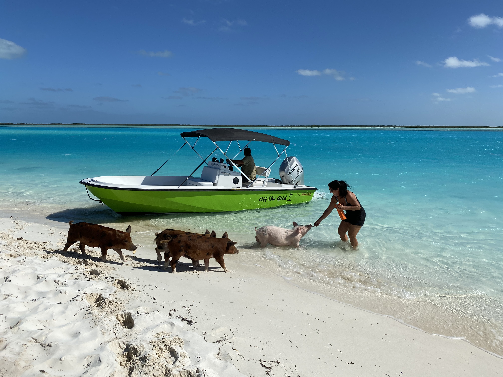
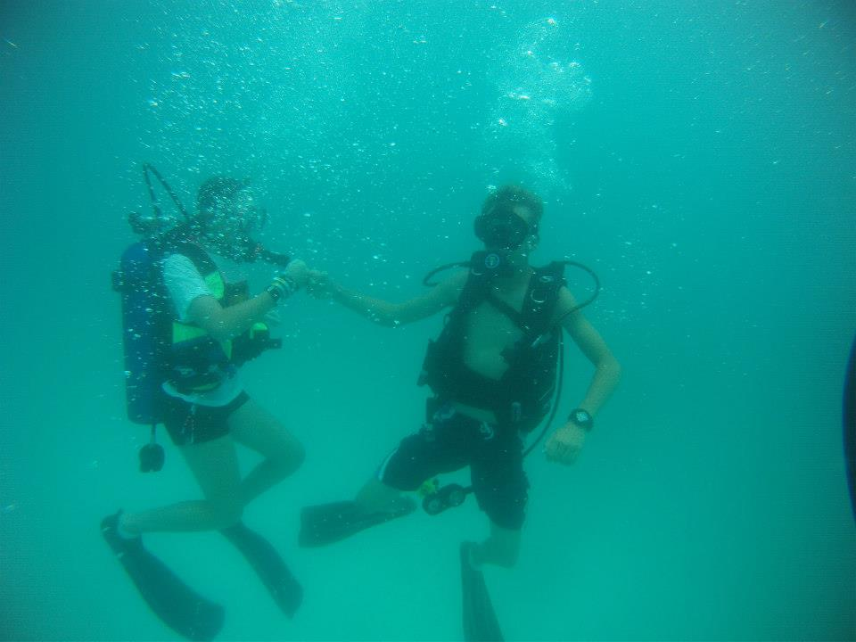
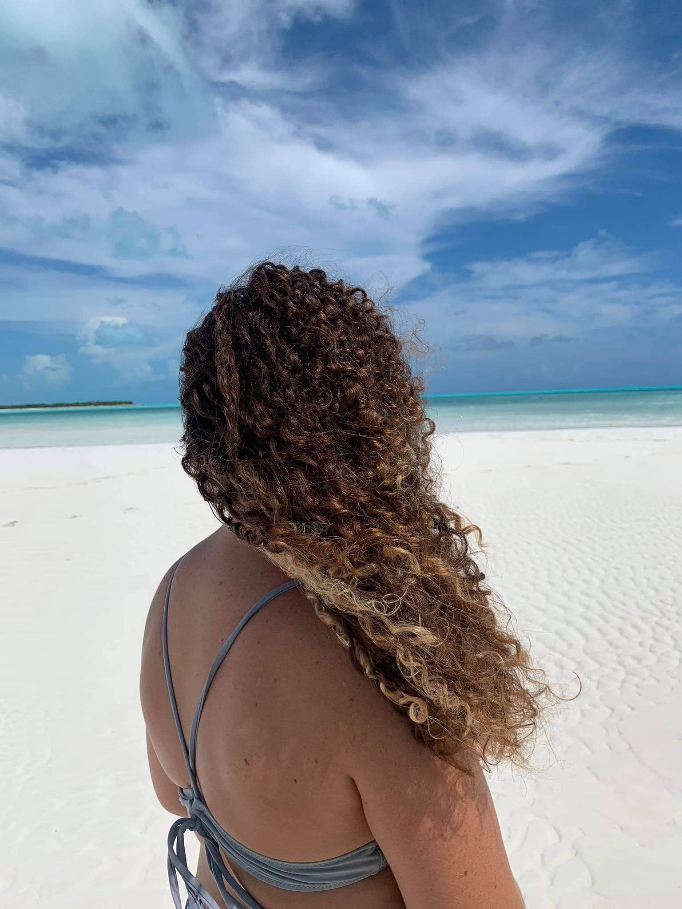
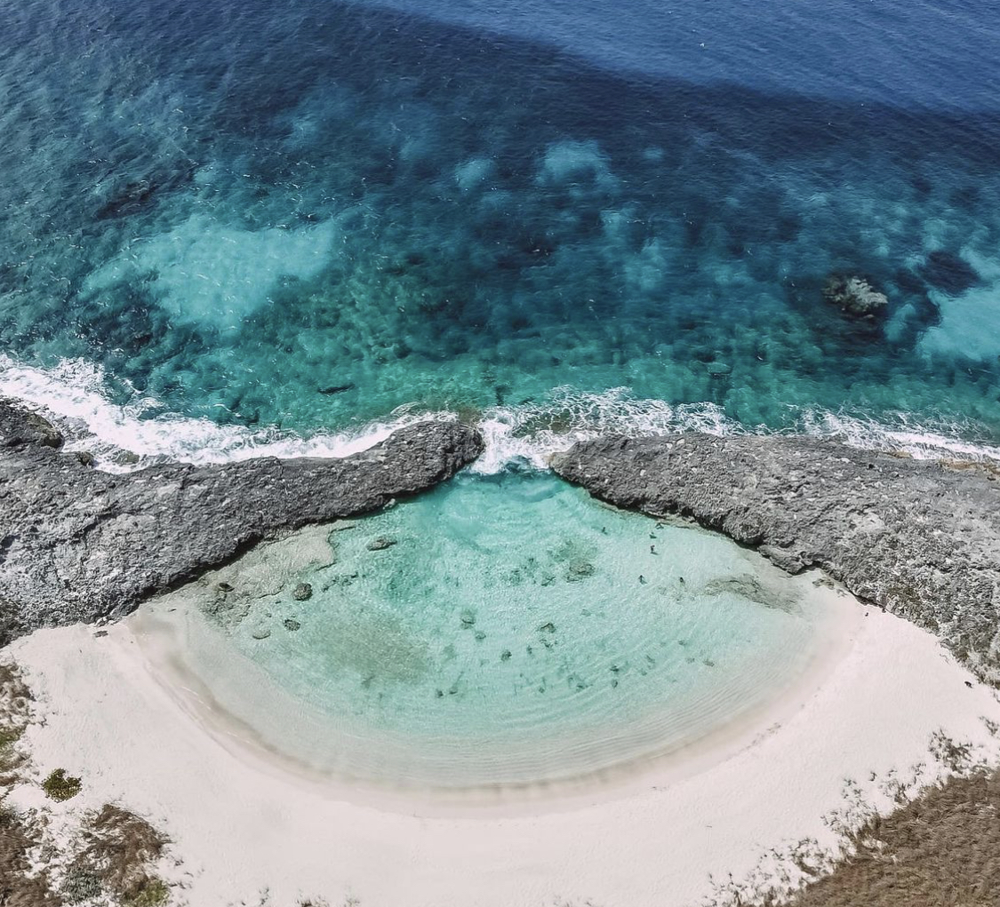

```{r setup, include=FALSE}
knitr::opts_chunk$set(echo = TRUE)
library(here)
library(tidyverse)
library(dplyr)
library(janitor)
library(here)
library(wordcloud)
library(RColorBrewer)
library(patchwork)
library(ggwordcloud)
library(paletteer)
```

Okay so if you've been on this blogging journey with me from the beginning, you'll know this blog post started out as just a list of my favorite beaches. But, this left me feeling a bit unsatisfied lol. After all, I am a data science student so I should include data right? Right! So, I polled my family and friends from home and asked them to rank the beaches from their most to least favorites and I am now redoing this blog post including data analysis. Yay me!

If you don't know my background, I grew up in a tiny island on The Bahamas, Long Island, with a population of a little over 3,000 people. There were definitely both perks and downfalls (hello climate change and hurricanes) of this, but one of my greatest pleasures of growing up there was the fact that there were endless beaches for me to explore always.

Being on the ocean is my happy place and completing my senior year of undergrad at McGill University online from home was an unexpected gift for that stage in my life. I also spent a ton of time with my family which I wouldn't have had the opportunity to do otherwise.

This blog post will feature my top 5 beaches (with photos of course). There will also be a surprise appearance of my mom's swimming piggies. I hope you enjoy!

<center>

{width="50%"}

</center>

Making the list to decide on my favorites was initially a hard process, but since then I have taken my bias out and the list will now be based on the 12 friends that completed my survey for me. So below I will do some fun data tidying and wrangling and see where the analysis goes from there.

### Wrangling my data

I needed to clean it up first and then I decided to rename all of the columns so that they were shorter and easier to use later in my code. I also created a tribble with the total rating for each beach and will use that for my ranking of the beaches.

```{r}
beaches_data <- read_csv(here("_posts", "2021-10-14-best-beaches","beaches.csv")) %>% 
  clean_names() %>% 
  rename("lowes" = "rate_lowes_beach", 
         "conch_point" = "rate_conch_point_beach",
         "sand_bars" = "rate_the_sand_bars", 
         "blue_hole" = "rate_deans_blue_hole", 
         "gordons" = "rate_gordons_beach", 
         "fave" = "name_your_favourite_beach")


totals <- tribble(
  ~beach, ~total,
  "Lowe's Beach", sum(beaches_data$lowes),
  "Conch Point Beach", sum(beaches_data$conch_point), 
  "The Sand Bars", sum(beaches_data$sand_bars),
  "Dean's Blue Hole", sum(beaches_data$blue_hole),
  "Gordon's Beach", sum(beaches_data$gordons)
)

totals <- totals %>% 
  arrange(total)

```

### Number 5

The award for the least favorite beach among my family and friends goes to `r totals[[1, 1]]`.

(I'm salty about this because Conch Point Deserves to be higher)

This beach admittedly has a weird name, but its just a beach named after the channel that it borders, Conch Point. This has always been a favorite place of mine, but now even more so since my parents worked with members of the community to build cabanas on the beach and my mom trained the pigs that now live on the beach and play with you.

<center>

{width="50%"}

</center>

It is just so stunningly perfect, year round. It is only accessible by boat so it means I get a beach and boat day in one and I just love that for me.

<center>

{width="50%"}

</center>

### Number 4

Let's see what my family gave me this time! The number 4 winner goes to `r totals[[2, 1]]`

This one is very reasonable. She had to make the list because she is world famous. Every year there are countless world records broken here because the Blue Hole is over 600 feet deep. The perfect place for a free-diving competition or if you're me, to get your scuba diving certification.

<center>

{width="25%"} {width="28%"} {width="28%"}

</center>

(Third Picture above from [Vertical Blue](https://www.facebook.com/verticalblue/))

If you grew up on Long Island, then you also know this is a perfect place for a lil adrenaline rush from jumping off of the cliff into the Blue Hole, just like my cousin is doing in the picture. Definitely a must do if you ever go to Long Island.

<center>

{width="40%"}

</center>

### Number 3

`r totals[[3, 1]]`

Okay so my friends just have bad taste, sorry guys. This beach deserves number 1 every time. Gordon's Beach is at the Southern most end of Long Island, right off the end of the road. Just miles of untouched beauty. Literally takes my breath away everytime I see it and I've been going here my entire life. She is a stunner and worth the drive every time!

<center>

{width="70%"}

</center>

### The Runner Up

What do we have here? `r totals[[4, 1]]`

So when I did my ranking, the sand bars were ranked lower because they are only above water at low tides and only accessible by boat, so you do really have to time it right. Apparently that is not a deterrent for anyone, including me and it is a treat because when you do time it right?? Absolute stunner! I love it at the sandbars. You really do be feeling like you in the middle of nowhere. (That last sentence was very Bahamian, I do not apologize.)

<center>

{width="40%"} {width="40%"}

</center>

I mean just look at the content!! She truly speaks for herself.

<center>

{width="40%"}
{width="38%"}
</center>

### The Winner

And the top award (which does not surprise me) goes to... `r totals[[5, 1]]`.

This one has been a family fave for as long as I have been alive. This was definitely the beach of my toddler years and I have fond memories of it. My aunt sent me the pictures of me below and told me I should recreate it now, I have yet to do it but it was taken on Lowe's Beach. My mom always spent summers on the beach everyday with me, my big brother and all of the cousins that could fit in the car. This beach was also probably where I learnt to swim.

<center>

{width="40%"} {width="40%"}

</center>

This is a view of the stunning beach from above. It is this little pool thing that has a reef at the entrance that water flows through and over but feels a lil safer for children because they can't go into the ocean.

<center>

{width="65%"}

</center>

At certain times in the year, the sand at this beach also has a pink tint, 10/10 rating. I love going to the beach with my friends here and we always have a good time.

<center>

{width="70%"}

</center>

No filter on any of these pictures because The Bahamas is THAT girl.

So after asking my friends for a ranking, I figured it was time for me to create my first !!WORD CLOUD!! I asked them all to write in the name of their favorite beach, on the list or not so I could make a fun little word cloud.

I had to do some fun wrangling to ensure that there was no duplicate stuff in my word clouds but it mostly went well. Shoutout to my classmates Scout and Juliet for doing a word cloud in the blog post about our summer courses, y'all truly made my life easier for this and figuring it all out.

```{r}

beaches_data <- beaches_data %>% 
  mutate(fave = tolower(fave))

beaches <- data.frame(table(beaches_data$"fave"))

beaches_df <- as.data.frame.matrix(beaches)

beaches_cloud <- ggplot(beaches_df, aes(label = Var1, size = Freq, color = Var1)) +
  geom_text_wordcloud() +
  scale_size_area(max_size = 10) +
  theme(plot.title = element_text(size = 25),
        panel.background = element_rect(fill = "white")) +
  labs(title = "Beach Beach Baby")

beaches_cloud
```

Admittedly, my word cloud is not very interesting butttt it's something and it is telling me that I probably should've included The Cape Beach. Here is a picture of that beaut.

{width="80%"}

Hope reading this post made your day better!
