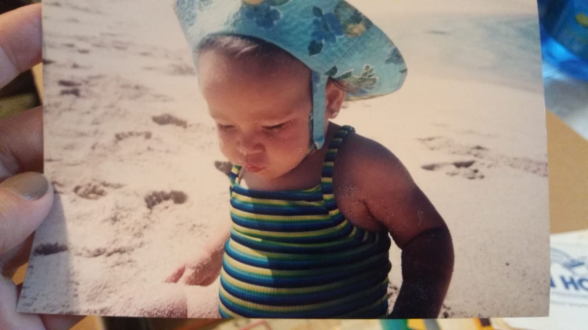
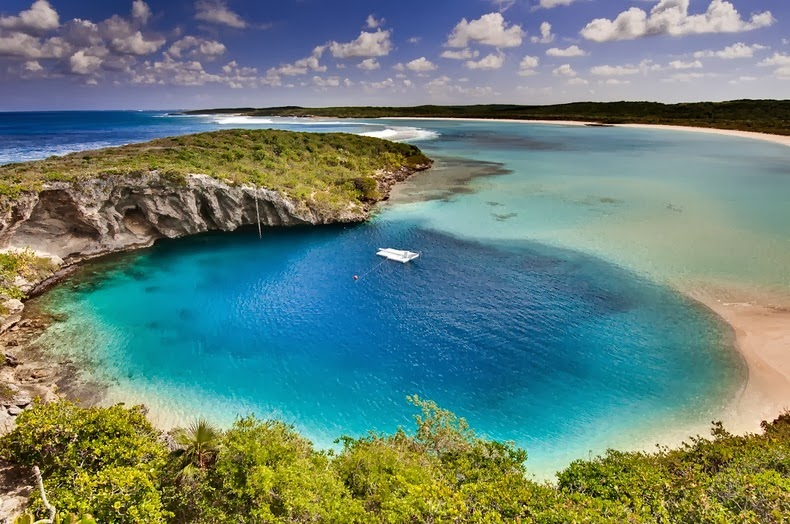
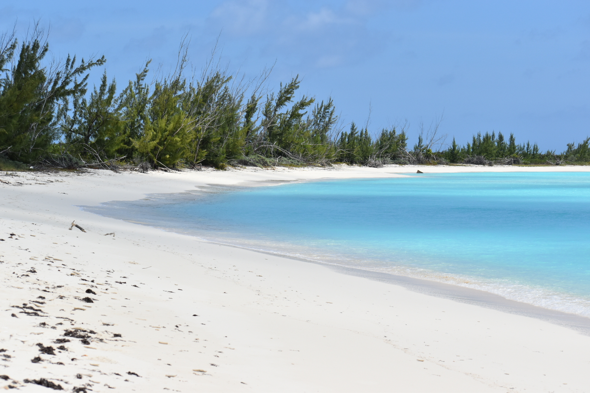

```{r setup, include=FALSE}
knitr::opts_chunk$set(echo = FALSE)
```


I started writing this blog post as a way for me to practice my blogging skills and I figured I could introduce my little island to the world and take a step away from my more technical blog posts.

If you don't know my background, I grew up in a tiny island on The Bahamas, Long Island, with a population of a little over 3,000 people. There were definitely both perks and downfalls (hello climate change and hurricanes) of this, but one of my greatest pleasures of growing up there was the fact that there were endless beaches for me to explore always.

Being on the ocean is my happy place and completing my senior year of undergrad at McGill University online from home was an unexpected gift for that stage in my life. I also spent a ton of time with my family which I wouldn't have had the opportunity to do otherwise.

This blog post will feature my top 5 beaches (with photos of course). There will also be a surprise appearance of my mom's swimming piggies. I hope you enjoy!

<center>

{width="50%"}

</center>


Making the list to decide on my favorites was a hard process. I was looking through my pictures to see what I had available because I'm not a big picture taker. I definitely live in the moment more often than not so I usually forget to take pictures and regret it later. Shoutout to Mia for documenting my entire grad school experience since I moved to SB in July, love ya!

Anyways, Top 5: Here we go

### 5: Lowe's Beach

This one has been a family fave for as long as I have been alive. This was definitely the beach of my toddler years and I have fond memories of it. My aunt sent me the pictures of me below and told me I should recreate it now, I have yet to do it but it was taken on Lowe's Beach. My mom always spent summers on the beach everyday with me, my big brother and all of the cousins that could fit in the car. This beach was also probably where I learnt to swim.

<center>

{width="40%"} {width="40%"}

</center>

This is a view of the stunning beach from above. It is this little pool thing that has a reef at the entrance that water flows through and over but feels a lil safer for children because they can't go into the ocean.

<center>

{width="65%"}

</center>

At certain times in the year, the sand at this beach also has a pink tint, 10/10 rating. I love going to the beach with my friends here and we always have a good time.

<center>

{width="70%"}

</center>

### 4: Conch Point Beach

This beach admittedly has a weird name, but its just a beach named after the channel that it borders, Conch Point. This has always been a favorite place of mine, but now even more so since my parents worked with members of the community to build cabanas on the beach and my mom trained the pigs that now live on the beach and play with you.

<center>
{width="50%"}

</center>

It is just so stunningly perfect, year round. It is only accessible by boat so it means I get a beach and boat day in one and I just love that for me.

<center>

{width="50%"}

</center>

### 3: The Sand Bars

Okay so my top three were the hardest to rate because honestly how can one choose between these three. I think this one was ranked lower because it is only above water at low tides and only accessible by boat, so you do really have to time it right. However when you do?? 

Absolute stunner! I love it at the sandbars. You really do be feeling like you in the middle of nowhere. (That last sentence was very Bahamian, I do not apologize.)

<center>

{width="40%"} {width="40%"}

</center>

I mean just look at the content!! She truly speaks for herself.

<center>

{width="40%"}
{width="38%"}

</center>

### 2: Dean's Blue Hole

So this one had to make the list because hello, she is world famous. Every year there are countless world records broken here because the Blue Hole is over 600 feet deep. The perfect place for a free-diving competition or if you're me, to get your scuba diving certification.

<center>
{width="25%"} {width="28%"} {width="28%"}

</center>

(Third Picture above from [Vertical Blue](https://www.facebook.com/verticalblue/))

If you grew up on Long Island, then you also know this is a perfect place for a lil adrenaline rush from jumping off of the cliff into the Blue Hole, just like my cousin is doing in the picture. Definitely a must do if you ever go to Long Island.

<center>
{width="40%"}
</center>


### 1: Gordon's Beach 

Okay this final one speaks for herself. She is at the Southern most end of Long Island, right off the end of the road. Just miles of untouched beauty. Literally takes my breath away everytime I see it and I've been going here my entire life. 
She is a stunner and worth the drive every time! 

<center>

{width="70%"}

</center>


No filter on any of these pictures because The Bahamas is THAT girl. Hope reading this post made your day better! 