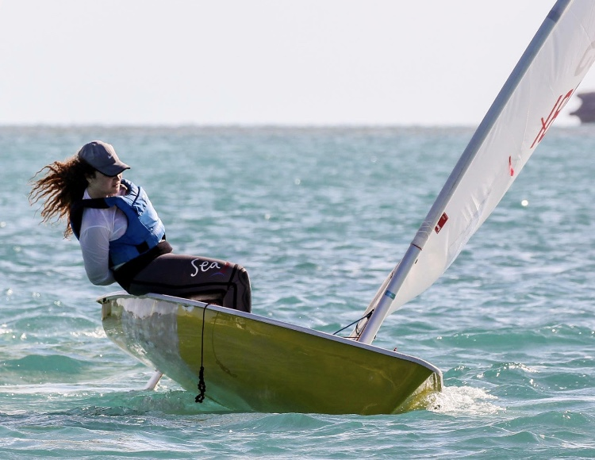

```{r setup, include=FALSE}
knitr::opts_chunk$set(echo = FALSE)
```

<p class="body">

Paloma Cartwright grew up on a small island in The Bahamas, where she
spent most of her days on the ocean. She developed a passion for nature
at an early age while also experiencing firsthand the impacts of climate
change on her home, surviving yearly hurricanes and witnessing the
constant depletion of marine ecosystems surrounding her island. To gain
the skills to solve these issues, she headed to McGill University where
she completed a BA in Computer Science and Environment in June 2021.
Throughout her undergraduate career, she interned with the Bahamas Sea
Turtle Research Institute and the Bimini Biological Field Station
Foundation - Sharklab. This work inspired her to dive into data science
to develop the skills to do more with environmental data.

</p>

{width="30%"}

<p class="body">

Paloma decided to bridge the gap between her disciplines and enrolled in
the Master of Environmental Data Science program at the Bren School of
Environmental Science and Management. Having completed her Master's
degree, Paloma is now pursuing a Ph.D in Ocean Science at the University
of Miami's Rosenstiel School of Marine, Atmospheric and Earth Sciences.
Her research under Dr. Lisa Beal focuses on understanding how the
changing ocean currents are impacting sea level rise and flooding events
in Florida and The Bahamas. Her primary interests lie in climate change
adaptation and she is using the skills gained in both her undergraduate
and master's degrees to study a topic that has very real impacts on her
home.

</p>

<p class="body">

When Paloma is not studying outside of SALT at Rosenstiel, you can find
her on the ocean somewhere. Sailing has been a guiding force in her life
since she was 5 years old and stepped in a Pram for the first time. She
has been sailing since then and has gone on to compete for Team Bahamas
in Optimist and Laser Class from 2010 to present. While she is not
sailing full time due to her studies, Paloma still finds time to be
outside whether it is scuba diving or hanging on the beach with friends.

</p>



