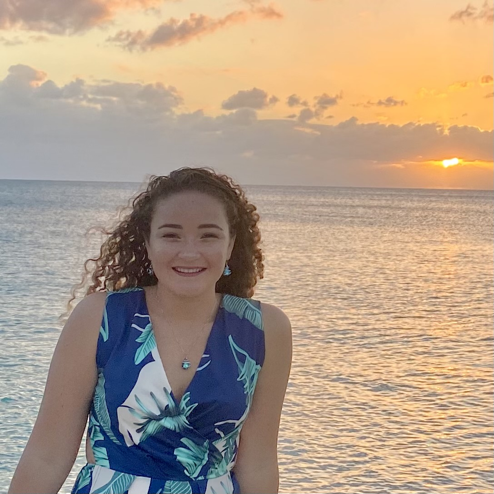

{width=25%}

 Paloma Cartwright grew up on a small island in The Bahamas, where she spent most of her days on the ocean. She developed a passion for nature at an early age while also  experiencing firsthand the impacts of climate change on her home, surviving yearly hurricanes and witnessing the constant depletion of marine ecosystems surrounding her island. To gain the skills to solve these issues, she headed to McGill University where she completed a BA in Computer Science and Environment in June 2021. Throughout her undergraduate career, she interned with the Bahamas Sea Turtle Research Institute and the Bimini Biological Field Station Foundation - Sharklab. This work inspired her to dive into data science to develop the skills to do more with environmental data. Paloma decided to bridge the gap between her disciplines and enrolled in the Master of Environmental Data Science program at the Bren School of Environmental Science and Management. Her primary interests lie in climate change adaptation and her long-term goal is to use data science to advance solutions to the environmental problems faced by The Bahamas. 

<ul class = "link_buttons">
  <a href="https://www.linkedin.com/in/paloma-cartwright-257b85171/">
    <button class="button"> LinkedIn </button>
  </a>
  <a href="https://github.com/palomacartwright">
    <button class="button">Github </button>
  </a>
   <a href="mailto:palomacartwright@bren.ucsb.edu">
    <button class="button">Email </button>
  </a>
</ul>
